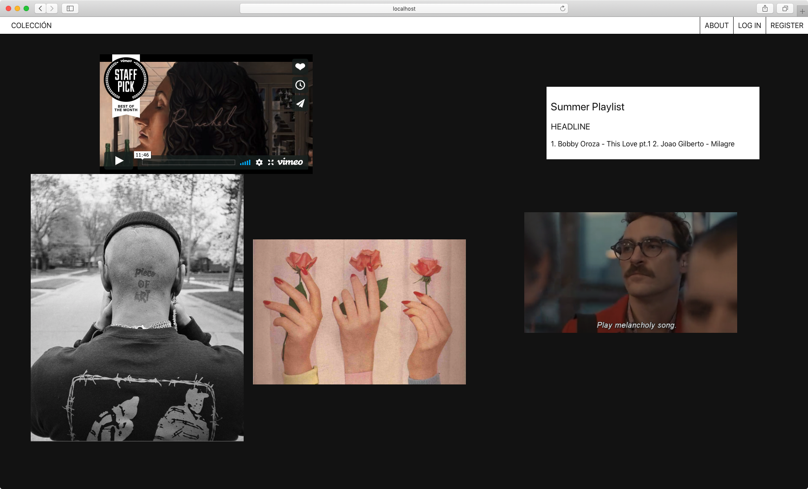
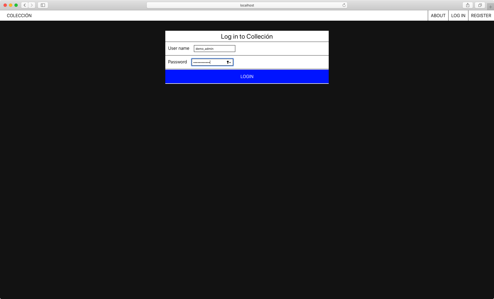
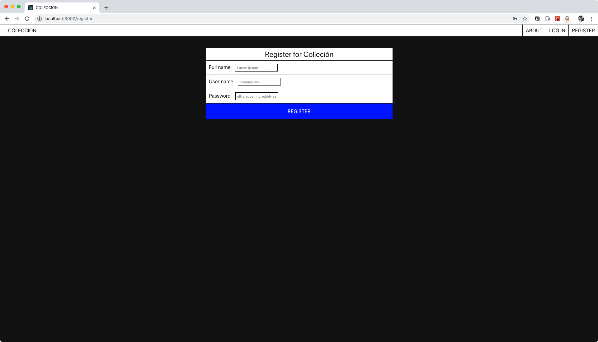
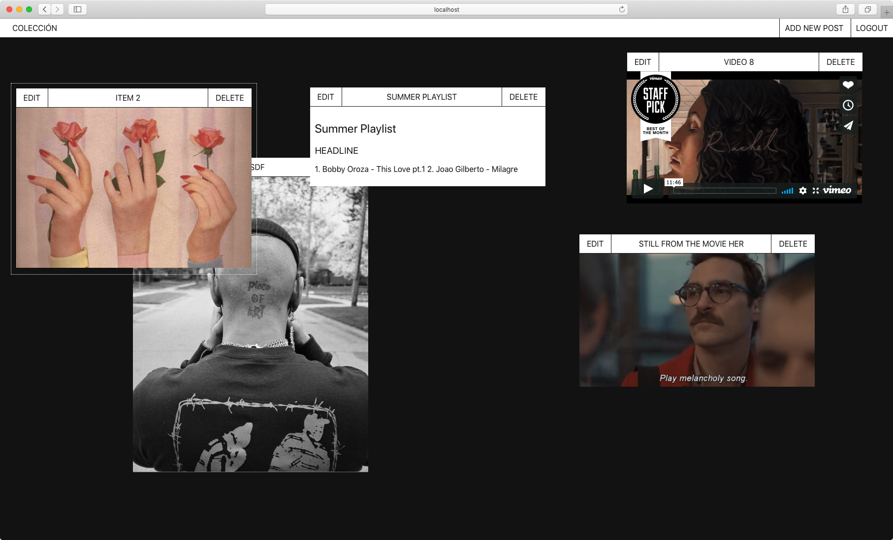
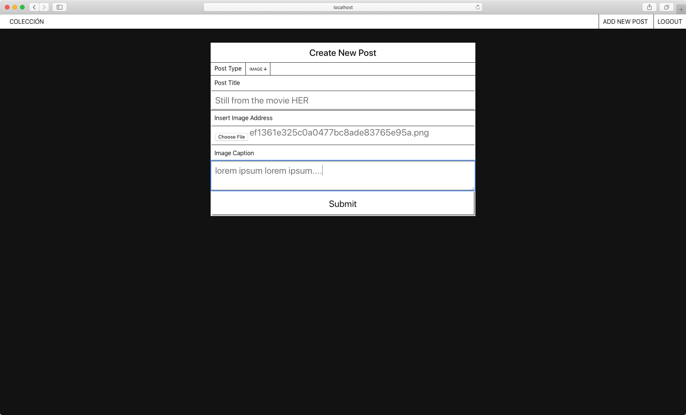
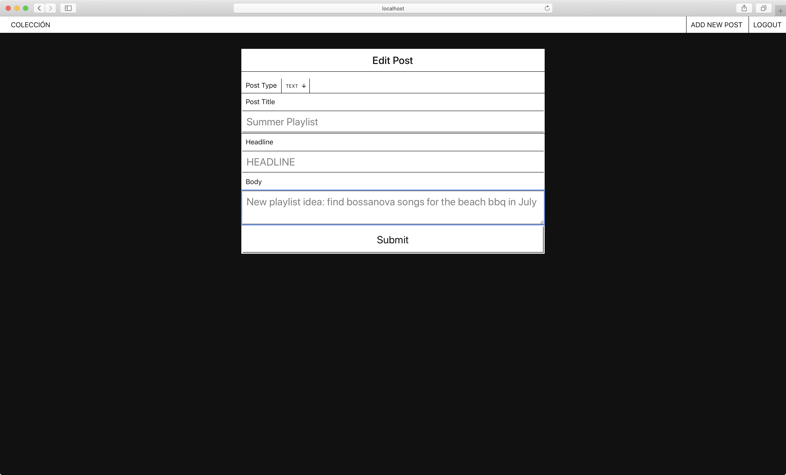

# Colección

Colección is an interactive, multimedia, collage-style blog leveraging React, Express, jQuery, Node, PostgreSQL, and SASS

Authors can create Image, Video, or Text post objects. These posts can be resized and rearranged as a collage

## Live App

https://coleccion.lucasvocos.now.sh/

## Built With

* [React](https://facebook.github.io/create-react-app)
* [Sass](https://www.npmjs.com/package/node-sass?activeTab=versions)
* [jQuery UI - For `.draggable()` & `.resizable()`](https://jqueryui.com/draggable/)
* [JWT Decode](https://jwt.io/)
* [React File Base64](https://www.npmjs.com/package/react-file-base64)

## Structure

Users can build interactive, multimedia, blogposts.

### Components

#### Header

The header uses conditional logic to check for an authentication token. If a user is authenticated, then the user displays links to create a new post object or to sign out.

If the user is not authenticated, there are rendered links describing the web app, as well as links to login and registration forms

#### Main Section

The main section will render specific components based on the routes provided and authentication status

**Public Routes**

* The `/login` route renders the `LoginForm` component will be rendered
* The `/register` route will render the `RegistrationForm` component
* `/about` renders the `OnBoard` component, giving a description of Colección

**Private Routes**

The following routes are only available if a Login request was successful, and the JsonWebToken is stored successfully in `sessionStorage`

* `/add-post` renders the `AddPost` form.
* `/post/:post_id` renders the `EditPost` form

#### Login Form

The login form sends a POST request to the API endpoint `/api/auth`

If the response is "OK" and includes an `authenticationToken`, that token is stored in the `sessionStorage`.

There is an idle timer that will automatically remove that token from `sessionStorage`, therefore logging the user out.

#### Registration form

The registration form makes a `POST` request to the `/api/users` endpoint.

If the response is OK, the user is redirected to the login form. The server will respond with relevant error messages if the username is already taken or the password is not complex enough

#### Post List

This component makes a `GET` request to the `/api/posts` and `/api/styles` endpoints. The responses are stored in the PostList state, and looping over the response makes new `Post` components.

#### Post

This component will display the post object. The post object is passed in as a `prop` from the parent `PostList` component.

#### Create Form

This component renders a form to create post objects.

This form will dynamically render relevant form fields based on the "post type" property. When a user selects a post type, the component will update the state, and based on the state value will render different form fields.

This form uses [React File Base64](https://www.npmjs.com/package/react-file-base64) to convert uploaded images into base64 strings.

The values are sent as the body in a `POST` request to the `/api/posts` endpoint.

#### Edit Post Form

When a user clicks "EDIT" on a post, this component will get the value of the post ID and make a `GET` request to the `/api/posts` endpoint.

The current values will be set as `defaultValue` in the form fields. When the user submits their changes, a `PATCH` request is sent to the `/api/posts` endpoint to update the post object.

## A Note About Testing

This application was built leveraging `jQuery UI` for the `draggable()` and `resizable()` methods on the post objects. Using jQuery in this React project has caused quite a bit of headache in terms of setting up tests. Moving forward, there are React modules that can be imported that give the same functionality

## Screenshots

### Main Page

### Login

### Register

### Authenticated Home

Resize, reorder, edit, and/or delete

### Create

### Edit Post

## Running the application

In the project directory, you can run:

### `npm start`

This runs the app in the development mode. 
Open [http://localhost:3000](http://localhost:3000) to view it in the browser.

The page will reload if you make edits. 
You will also see any lint errors in the console.

### `npm test`

Launches the test runner in the interactive watch mode. 
See the section about [running tests](https://facebook.github.io/create-react-app/docs/running-tests) for more information.

### `npm run build`

Builds the app for production to the `build` folder. 
It correctly bundles React in production mode and optimizes the build for the best performance.

The build is minified and the filenames include the hashes. 
Your app is ready to be deployed!

See the section about [deployment](https://facebook.github.io/create-react-app/docs/deployment) for more information.

### `npm run eject`

**Note: this is a one-way operation. Once you `eject`, you can’t go back!**

If you aren’t satisfied with the build tool and configuration choices, you can `eject` at any time. This command will remove the single build dependency from your project.

Instead, it will copy all the configuration files and the transitive dependencies (Webpack, Babel, ESLint, etc) right into your project so you have full control over them. All of the commands except `eject` will still work, but they will point to the copied scripts so you can tweak them. At this point you’re on your own.

You don’t have to ever use `eject`. The curated feature set is suitable for small and middle deployments, and you shouldn’t feel obligated to use this feature. However we understand that this tool wouldn’t be useful if you couldn’t customize it when you are ready for it.

### Deployment

This section has moved here: https://facebook.github.io/create-react-app/docs/deployment

### `npm run build` fails to minify

This section has moved here: https://facebook.github.io/create-react-app/docs/troubleshooting#npm-run-build-fails-to-minify
